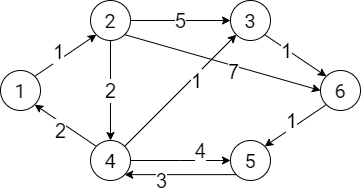

Find the shortest path between the *start* vertex and the *finish* vertex using Dijkstra's algorithm.  

### Sample Input
6 10 1 5  
1 2 1  
2 3 5  
2 4 2  
2 6 7  
3 6 1  
4 1 2  
4 3 1  
4 5 4  
5 4 3  
6 5 1  

### Sample Output
6  
1 2 4 3 6 5  

### Explanation
The input first line contains the number of vertices, the number of edges, the start vertex and the finish vertex.  
Each of the remaining lines contains 2 vertices and the distance of them.  

.

The output includes the shortest distance between the start and the finish, which are the vertex 1 and 5, and the vertices of the shortest path.  

### Demo with pencil and paper
(d, u) denotes that *d* is the distance from *start* and *u* is the preceded vertex.  
The asterisk * indicates the least element in the whole row for next travel from it.

|    1    |    2    |    3    |    4    |    5    |    6    |
|:-------:|:-------:|:-------:|:-------:|:-------:|:-------:|
| (0, -)* |  (∞, -) |  (∞, -) |  (∞, -) |  (∞, -) |  (∞, -) |
|    -    | (1, 1)* |  (∞, -) |  (∞, -) |  (∞, -) |  (∞, -) |
|    -    |    -    |  (6, 2) | (3, 2)* |  (∞, -) |  (8, 2) |
|    -    |    -    | (4, 4)* |    -    |  (7, 4) |  (8, 2) |
|    -    |    -    |    -    |    -    |  (7, 4) | (5, 3)* |
|    -    |    -    |    -    |    -    | (6, 6)* |    -    |